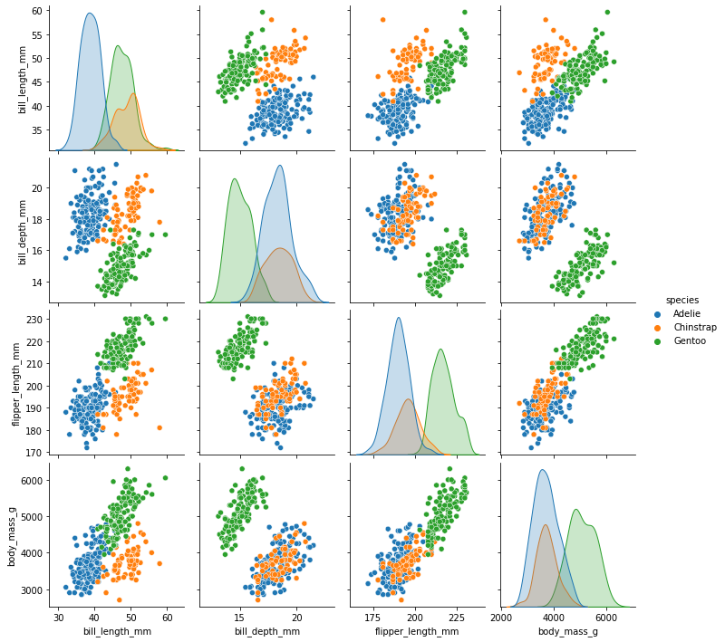

# Introduction and motivation

:::{objectives}

- Know what to expect from this course
- Build a general, programming-language agnostic notion of performance
:::

:::{instructor-note}

- Inform the format of this talk
    - Mix of talk, type-along and demos
- 5 min teaching
:::

Python and its defacto implementation CPython is now widely used for a
spectrum of applications. It has now experienced practitioners doing
web-development, analytics, research and data science. This is possible
because of the following traits of the Python ecosystem:

- Batteries included
- High-level programming that abstracts away the technical details
- Mature well-maintained libraries which form a firm foundation, the scientific Python ecosystem, which includes:

::::{tab-set}

:::{tab-item} Core numeric libraries

{h=200px align=right}

- [**Numpy**](https://www.numpy.org/): numerical computing with powerful numerical arrays objects, and routines to manipulate them.

- [**Scipy**](https://www.scipy.org/): high-level numerical routines. Optimization, regression, interpolation, etc.

- [**Matplotlib**](https://matplotlib.org/): 2-D visualization, “publication-ready” plots.

:::

:::{tab-item} Advanced IDEs

{h=300px align=right}

- [**IPython**](https://ipython.org/): an advanced **Python console**

- [**Jupyter**](https://jupyter.org/): **notebooks** in the browser

:::

:::{tab-item} Domain specific libraries

{h=300px align=right}

- [**pandas**](https://pandas.org) for reading, writing and analyzing heterogenous tabular data

- **statsmodels, seaborn** for [statistics](https://lectures.scientific-python.org/packages/statistics/index.html#statistics)

- **sympy** for [symbolic computing](https://lectures.scientific-python.org/packages/sympy.html#sympy)

- **scikit-image** for [image processing](https://lectures.scientific-python.org/packages/scikit-image/index.html#scikit-image)

- **scikit-learn** for [machine learning](https://lectures.scientific-python.org/packages/scikit-learn/index.html#scikit-learn-chapter)

:::

::::

and many more...

## Extensions: a technical detail hidden in plain sight

A common theme behind the Python standard library and its popular packages is that some parts of the code which are computationally intensive are actually modules or functions which are either:

- **interfaced extensions** with an external implementation in C, C++, Fortran, Rust...
- **source-to-source extensions** written in Python or Python-like code, which is compiled ahead-of-time or just-in-time

Extensions can be imported as normal Python functions or modules. There are many tools which help you in creating extensions:

```{figure} ./img/python_performance_landscape.png
:alt: Python performance landscape

Figure: The coloured bubbles represent **programming languages**. An outward arrow represents **exporting** a code into
an extension using a runtime or a library. An inward arrow represents **importing** an extension (or linking to a code using an API,
such as Python's C-API or via a foriegn function interface (FFI). The choices are many!

```

:::{discussion}

What are the advantages and disadvantages of using Python code written using multiple programming languages under the hood, in terms of software development and maintenance?
:::

:::{solution}
**Pros 👍**: This approach enables us to:

- build high-level, performant applications which tend to be readable
- focus on the problem at hand, without getting sidetracked with implementation details
- rapidly prototype the experimental parts of the code
- interfacing allows re-use of established codes

**Cons 👎**: Some known downsides are:

- interfaced codes require knowledge of multiple languages
- compiled codes are harder to debug and rapidly-prototype

:::

Now we have a notion of how extensions work. We could use extensions to address performance issues. However building an extension is quite often the last resort.
More on that will be discussed in the next episode.

## Different kinds of performance bottlenecks

- **I/O bound**: the code idles often and is waiting for a disk or network read/write operation to finish. Such bottlenecks can be often remedied by caching, multi-threading or async-programming.
- **Memory bound**: the data to be processed does not fit in the RAM and the code needs to process data in batches instead. This is often a hardware limitation.
- **CPU bound**: the code consumes a lot of CPU cycles, often seen by monitoring the system showing 100% CPU usage in 1 core for serial applications, or in all cores for parallel applications. **This will be the focus of this workshop**.

## Gems of wisdom

Before we dive further into the workshop it is important to remember some idioms, which is true in the case of most real-world applications.

:::{card} Limitations of performance improvement

> The overall performance improvement gained by optimizing a single part of a system is **limited by the fraction of time that the improved part is actually used**.

-- _Amdahl's law_[^2] (see this [demo](https://demonstrations.wolfram.com/AmdahlsLaw/))
:::

[^2]: Although Amdahl's law is about speedup due to parallelization, we can still
    associate it with speedup of serial programs. This is because the law is
    formulated in terms of execution-time.

:::{card} Premature optimization is the root of all evil.

> The real problem is that programmers have spent far too much time **worrying about efficiency in the wrong places and at the wrong times**; _premature optimization is the root of all evil (or at least most of it) in programming_.

> Programmers waste enormous amounts of time thinking about, or worrying about, the speed of noncritical parts of their programs, and these attempts at efficiency actually have a **strong negative impact when debugging and maintenance are considered**. We should forget about small efficiencies, say about _97% of the time: premature optimization is the root of all evil_. Yet we should not pass up our opportunities in that critical 3%.

-- _Donald Knuth_ (computer scientist, mathematician and the author of _The Art of Computer Programming_)
:::

:::{card}  Measure, don't guess.
:::

:::{card} Pareto principle or the 80/20 rule

> 80 percent of the runtime is spent in 20 percent of the source code.

-- _Scott Meyers_ (author of _Effective C++ Digital Collection: 140 Ways to Improve Your Programming_)

:::

---

:::{keypoints}

- Find a balance between _runtime efficency_ and _cost of development_.

- Tests can help in maintain correctness before you change the code.

- CPU-bound or I/O-bound or memory bound?

- Do not optimize everything.

- Creating extensions are one way of improving performance
:::
