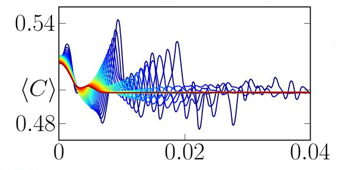

# Introduction and motivation

:::{objectives}
- Know what to expect from this course
:::

:::{instructor-note}

   - 10 min teaching
:::

Python and its defacto implementation CPython is now widely used for a 
spectrum of applications. It has now experienced practitioners doing 
web-development, analytics, research and data science. This is possible
because of the following traits of the Python ecosystem:

- Batteries included
- High-level programming that abstracts away the technical details
- Mature well-maintained libraries which form a firm foundation, the scientific Python ecosystem[^ecosystem], which includes:

::::{tab-set}

:::{tab-item} Core numeric libraries

{h=200px align=right}

- [**Numpy**](https://www.numpy.org/): numerical computing with powerful numerical arrays objects, and routines to manipulate them.

- [**Scipy**](https://www.scipy.org/): high-level numerical routines. Optimization, regression, interpolation, etc.

- [**Matplotlib**](https://matplotlib.org/): 2-D visualization, “publication-ready” plots.

:::

:::{tab-item} Advanced IDEs

{h=300px align=right}

- [**IPython**](https://ipython.org/): an advanced **Python console**
    
- [**Jupyter**](https://jupyter.org/): **notebooks** in the browser

:::

:::{tab-item} Domain specific libraries

{h=300px align=right}

- [**pandas**](https://pandas.org) for reading, writing and analyzing heterogenous tabular data 

- **statsmodels, seaborn** for [statistics](https://lectures.scientific-python.org/packages/statistics/index.html#statistics)
    
- **sympy** for [symbolic computing](https://lectures.scientific-python.org/packages/sympy.html#sympy)
    
- **scikit-image** for [image processing](https://lectures.scientific-python.org/packages/scikit-image/index.html#scikit-image)
    
- **scikit-learn** for [machine learning](https://lectures.scientific-python.org/packages/scikit-learn/index.html#scikit-learn-chapter)

:::

::::

and many more...

[^ecosystem]: Images and description by [authors of lectures.scientific-python.org](https://lectures.scientific-python.org/preface.html#authors) is licensed under [CC BY 4.0](https://creativecommons.org/licenses/by/4.0/), by [authors of Project Jupyter](https://jupyter.org)  is licensed under [BSD 3-Clause "New" or "Revised" License](https://github.com/jupyter/jupyter.github.io/blob/main/LICENSE) and by [authors of deep-learning-intro](https://github.com/carpentries-incubator/deep-learning-intro/blob/main/AUTHORS) is licensed under [CC BY 4.0](https://creativecommons.org/licenses/by/4.0/).

A common theme behind the Python standard library and its popular packages is that some parts of the code which are computationally intensive are actually modules or functions which are either:

- **interfaced** with an external implementation in C, C++, Fortran, Rust...
- **extensions** written in Python or Python-like code, which is compiled ahead-of-time or just-in-time

and then *exported* as Python functions. 

:::{discussion}

What are the advantages and disadvantages of using Python with regard to software-development and performance?
:::

:::{solution}
**Pros 👍**: This approach enables us to:
- build high-level, performant applications which tend to be readable
- focus on the problem at hand, without getting sidetracked with implementation details
- rapidly prototype the experimental parts of the code
- interfacing allows re-use of established codes

**Cons 👎**: Some known downsides are:
- interfaced codes require knowledge of multiple languages
- compiled codes are harder to debug and rapidly-prototype

:::

## Different kinds of performance bottlenecks

- **CPU bound**: the code consumes a lot of CPU cycles, often seen by monitoring the system showing 100% CPU usage in 1 core (for serial applications) or all cores for parallel applications. **This will be the focus of this workshop**.
- **I/O bound**: the code idles often and is waiting for a disk or network read/write operation to finish. Such bottlenecks can be often remedied by caching, multi-threading or async-programming.
- **Memory bound**: the data to be processed does not fit in the RAM and the code needs to process data in batches instead. This is often a hardware limitation.

## Gems of wisdom

Before we dive into the workshop it is important to remember some idioms, which is
true in the case of most real-world applications.

:::{card} The overall performance improvement gained by optimizing a single part of a system is limited by the fraction of time that the improved part is actually used.

-- Amdahl's law (see this [demo](https://demonstrations.wolfram.com/AmdahlsLaw/))
:::

:::{card} Premature optimization is the root of all evil.
-- _Donald Knuth_ (computer scientist, mathematician and the author of _The Art of Computer Programming_)
:::

:::{card}  Measure, don't guess.
:::

Profiling can give an insight into which parts of the code need attention. Tests should be incorporated prior to optimizing a code. Finally, more often than not,

:::{card} 80 percent of the runtime is spent in 20 percent of the source code
-- _Scott Meyers_ (author of _Effective C++ Digital Collection: 140 Ways to Improve Your Programming_)

:::

:::{keypoints}
Ask yourself. Should you optimize?

- Find a balance between _runtime efficency_ and _cost of development_

- Do not optimize everything.

- CPU-bound or I/O-bound or memory bound?

- Measure, don't guess! **Profile** to find the bottlenecks ⏱️
  - `python -m cProfile --help`

- Use efficient **algorithms** and **data structures**.

- Test driven development to maintain correctness
:::